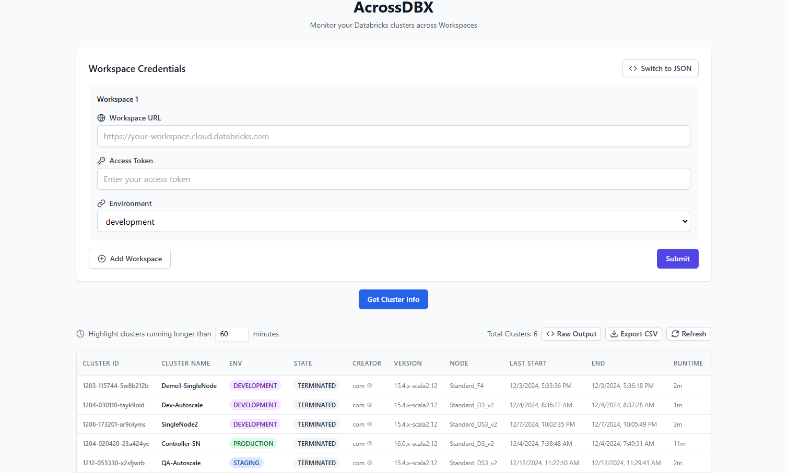

Monitor Databricks clusters across Workspaces

## Features

- **Interactive Cluster Details**: Retrieve detailed information about clusters across a list of specified workspaces.
- **Input Options**: Accepts Environment, Workspace URL, and Token via a form or JSON input.
- **Cluster Highlighting**:
  - Automatically highlights clusters with an auto-termination time greater than **60 minutes**.
  - Auto highlights clusters utilizing **Photon**.
- **Export Functionality**: Easily export results as a **CSV** file for further analysis.

## Table of Contents

- [Live App](#live-app)
- [Run Locally](#run-locally)
- [Instructions](#instructions)
- [Contributing](#contributing)
- [License](#license)

## UI


## Live App
Try Here: https://acrossdbx.vercel.app/

## Run Locally

### 🐳 Docker

```bash
git clone https://github.com/g-kannan/AcrossDBX.git
docker build -t acrossdbx .
docker run -p 3000:3000 acrossdbx
```

AcrossDBX will be running on <http://localhost:3000/>

## Instructions
1. Input Environment, Workspace URL & Token via Form

    or

2. Click "Swith to JSON" and input details via JSON format 

```json
{
  "url": "https://<workspace1_url>",
  "token": "<token>",
  "environment": "<environment>"
},
{
  "url": "https://<workspace2_url>",
  "token": "<token>",
  "environment": "<environment>"
}
```


## License

This project is licensed under the [GPL License](LICENSE).